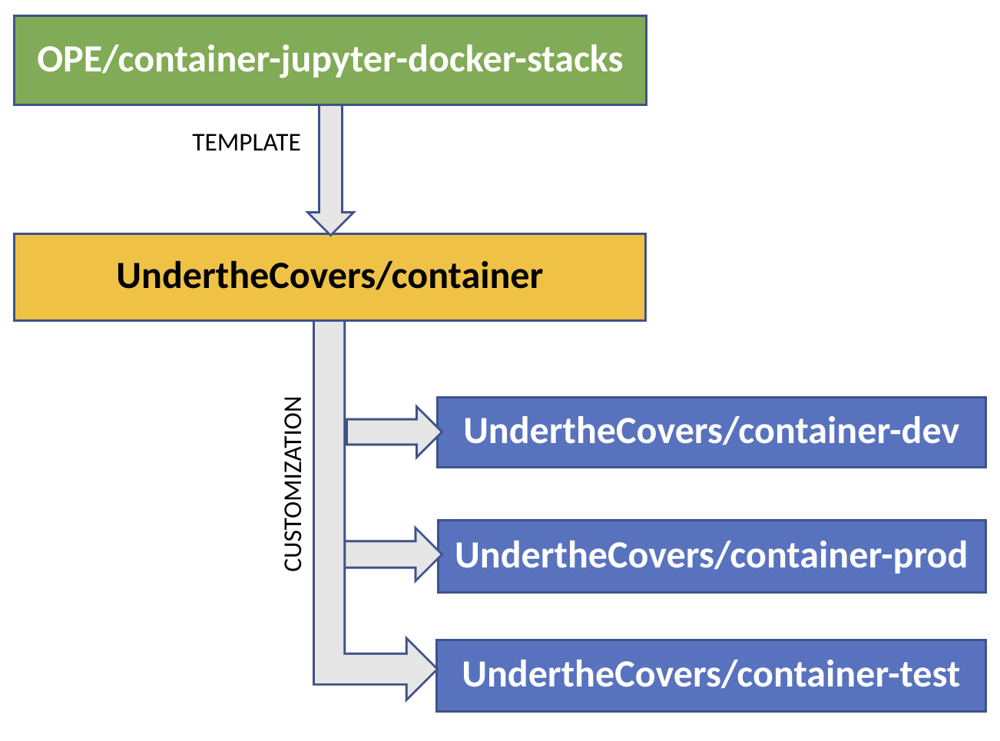
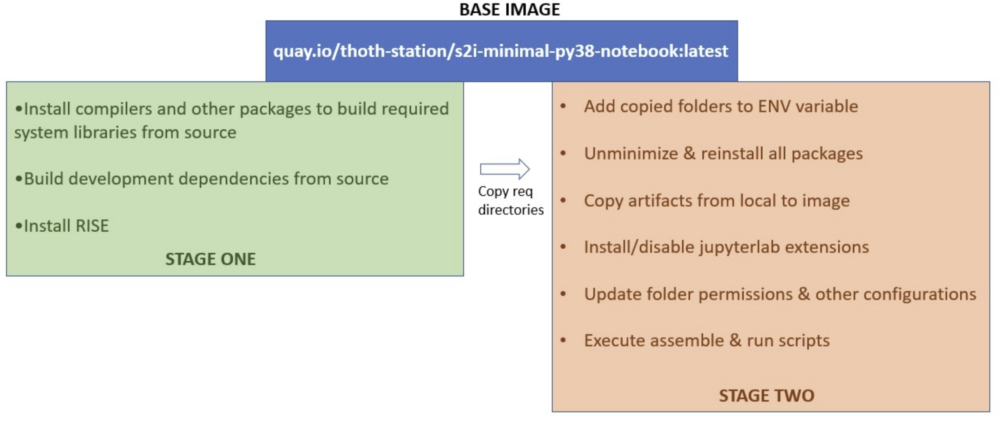

# Getting started

This quick guide to leverage this repo to customize the [source-to-image](https://github.com/openshift/source-to-image) jupyter notebook builder image for OpenDatahub JupyterHub. This branch creates an ubuntu based s2i builder image for the jupyter container that takes the [textbook content](https://github.com/jappavoo/UndertheCovers) and generate a new image which can be deployed in ODH environment. 

>**_Note:_** This container is only a template and does not contain the textbook content.

## Anatomy of the branch

We have the base directory that includes files like requirements, and other configurations required during the build step. The layout of this branch looks like: 
  
## Configurations

Listing significant configurations part of the build process.
- base-image: 
	* **docker.io/jupyter/minimal-notebook:2022-07-07** is the base image used, configured as: <base_registry>/<base_image>:<base_tag>
	* The respective files as available under folder 'base'
- Adding system libraries:
	* Distribution package listed in 'base/distro_pkgs' installs the system libraries during the build time
- Adding python libraries:
   * List of pre-requisites that should be installed before other python libraries to be updated in 'base/python_prereqs'
   * To specify python libraries update 'base/python_prereqs' file
- Jupter extensions:
   * Extensions to be **enabled** - 'base/jupyter_enable_etxs'
   * Extensions to be **disabled** - 'base/jupyter_disable_etxs'
- Default user id:
   * 'base/ope_uid' file should have the platform assigned uid. **UID mismatch will result in a failure of server launch**

- makefile -defines the set of commands/targets to run against the base image, described in a separate section.

## Repo Lineage
&nbsp;&nbsp;  This UndertheCovers repo is customized from [OPE/container-jupyter-docker-stacks](https://github.com/OPEFFORT/ope/tree/container-jupyter-docker-stacks) for [UndertheCovers](https://github.com/jappavoo/UndertheCovers/tree/main) textbook content.
   &nbsp;&nbsp;  This repo includes additional libraries to support the content. Further customization available as branches with a prefix **'container-'** includes the deployment environment-specific configurations like development, testing, production etc. 
   

#### Updating default user id:
 &nbsp;&nbsp;  When customizing the image for a new environment, 'base/ope_uid' file should reflect the target platform's assigned user id. **Images built with improper UID will result in a failure of server launch**

#### CUST variable:
 &nbsp;&nbsp;  When building customized the image for a new environment, the mandatory variable with build 'CUST' should be assigned appropriate value. 
 For instance, 'make CUST=dev build', 'make CUST=prod build' etc.

## Docker build process

The container template is created over two stages to achieve better organization and to reduce size. 

**Stage one:**
- Add libraries required to install/build development dependencies

**Stage two:**
- Copy the final binary folders from stage-one.
- Include artifacts(executables, configs) from local
- Enable jupyter extensions
- Foler permissions

The final image created after second stage contains only the required binaries, the process looks like : 
  

## Additional Resources

### Makefile - targets
This repo utilizes make tool to efficiently build, run, tag and publish the jupyter notebook s2i builder image. 
- build - builds the custom s2i builder image
- push - push current built to private registry
- publish - push the current private build to public registry
- pull - pull the most recent public image
- pull-priv - pulls the most recent private image
- root - executes the private image as root user
- user - executes the private image as the default user
- run - starts published version with jupyter lab interface
- run-priv - starts private version with jupyter lab interface
### Adding python packages
&nbsp;S2i framework uses [micropipenv](https://github.com/thoth-station/micropipenv) a pip wrapper tool to manage the python library installation. The requirements file generated using micropipenv should be updated in the repository to include additional python libraries. 

  Follow the steps to generate requirements.txt using micropipenv [here](https://github.com/AbiShanna/Ope-Documentation/tree/main/micropipenv).

### Launching in desktop
The desktop mode requires the image to be re-built with the local user-id in your local workstation that has docker running, 
- Clone the git repository
- Checkout branch 'container'
- Update the base/ope_uid with that of your local user id
- Build the image using 'make CUST=local build'
- Launch the container using 'make CUST=local run'

